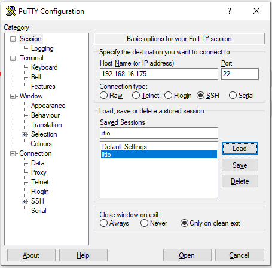
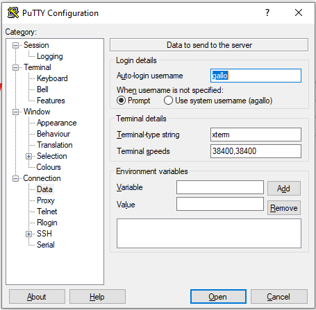
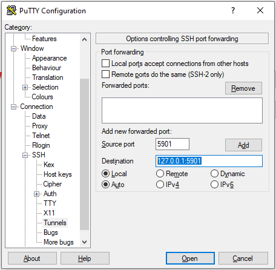
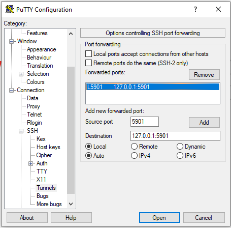
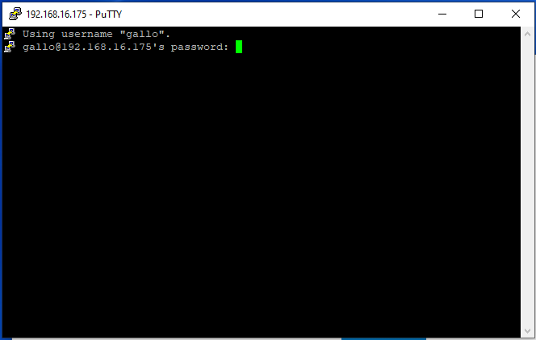
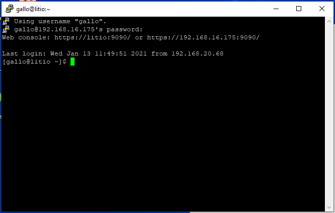
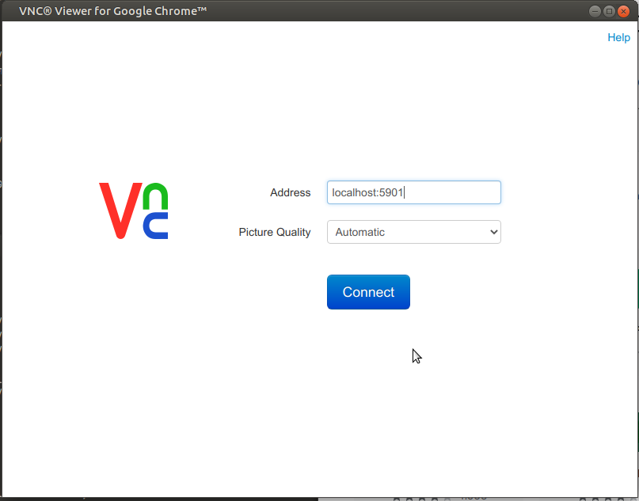
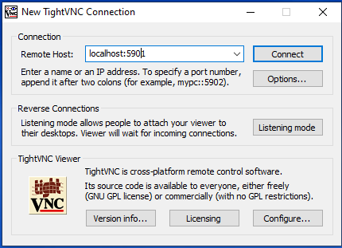
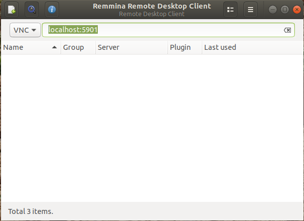

How to connect to litio
=======================

.. warning:: Make sure the CIC VPN is active if you are trying to connect from outside the institute

.. topic:: You need to have at hand:

    IP address
        **192.168.16.160**
    *username*
        same as in your email address (e.g.: agallo)
    *password*
        usually yournameyear (e.g.: alfonso2021; should be changed from the terminal on first login with passwd)
    *vnc_id*
        given by the admin (e.g.: 5901)
    *vnc_pass*
        same as *password* (e.g.: alfonso2021; should be changed from the terminal on first login with vncpasswd)

Web browser
###########
No matter your operating system, you can always use the web browser to 
access the terminal (note: the terminal!) of the machine, through the
`address <https://192.168.16.160:9090/>`_:

https://192.168.16.160:9090/

Windows
#######
On first access, remember to change the passwords from a terminal.

.. warning:: Change passwords!

   * **passwd** to change your system-wide password
     
   * **vncpasswd** to change your VNC password (answer *no* to the question \'Would you like to entera view-only password (y/n)?\'

1. Establish a tunnel
---------------------
To connect to the machine using the graphical interface, first follow this steps to establish a tunnel:

1. Download and `install Putty`_

.. _install Putty: https://www.chiark.greenend.org.uk/~sgtatham/putty/latest.html

2. Open PuTTY and **enter the address 192.168.16.160*. Enter a name (e.g.: litio) and **click save** so that you don’t have to enter the data every time you connect.

3. Go to Connection -> Data and **enter your username**

4. Expand the SSH tab, go to SSH -> Tunnels. **Fill in the Source port and Destination boxes** with your *vsc_id* and **127.0.0.1:**\ *vsc_id* **data**, respectively. Check image below.

5. **Click Add** to save the tunnel.

6. Go back to Session tab and **save the changes** in ‘litio’ (or the name you chose).

7. **Click Open** to start a new ssh session. A terminal will open, **enter your password**. Be aware that **although you type, you will not see any character**: it is fine!

8. Once logged in, you should see something like this.

2. Connect
----------
**With the tunnel active**, the VNC connection can be established.

.. _see-above:

Google Chrome VNC
^^^^^^^^^^^^^^^^^
Quite handy as there is no need to install anything on your personal computer.

1. Go to the Google Web Store, `add VNC viewer for Google Chrome <https://chrome.google.com/webstore/detail/vnc%C2%AE-viewer-for-google-ch/iabmpiboiopbgfabjmgeedhcmjenhbla>`_ and start it.

2. Enter **localhost:**\ *vnc_id* (e.g.: localhost:5901).

Tight VNC
^^^^^^^^^
Alternatively, a program can be installed (any other VNC client will do).

1. `Download <https://www.tightvnc.com/download.php>`_ and install TightVNC
2. **Connect** to **localhost:**\ *vnc_id*

If everything went fine, you will see your desktop on litio. 

Linux
#####

On first access, remember to change the passwords from a terminal.

.. warning:: Change passwords!

   * **passwd** to change your system-wide password
     
   * **vncpasswd** to change your VNC password (answer *no* to the question \'Would you like to entera view-only password (y/n)?\'

Terminal
^^^^^^^^
To access litio via the terminal, use ssh:

``ssh username@192.168.16.160``

To avoid entering the password every time you connect, ssh-keygen could be used as described for instance here: `how to set up SSH keys <https://www.digitalocean.com/community/tutorials/how-to-set-up-ssh-keys-2>`_

.. note:: Access via Web Browser

   Remember you can also access a terminal via your web browser entering in the search bar the following `address <https://192.168.16.160:9090/>`_:

   https://192.168.16.160:9090/

GUI
^^^
To open the Graphical User Interface follow these steps:

1. Establish a tunnel
---------------------
Open a terminal in your local computer and execute the command:

``ssh -L vnc_id:127.0.0.1:vnc_id username@192.168.16.160``

For example: *ssh -L 5901:127.0.0.1:5901 gallo@192.168.16.160*.

**Do not close!** As in windows it needs to stay open in order to allow the VNC
client to connect.

2. Connect
----------

Google Chrome VNC
^^^^^^^^^^^^^^^^^
Same procedure as for Windows (see :ref:`see-above`).

Remmina
^^^^^^^
1. Install Remmina `more instructions here <https://remmina.org/how-to-install-remmina/>`_:

   ``sudo apt-add-repository ppa:remmina-ppa-team/remmina-next``

   ``sudo apt update``

   ``sudo apt install remmina remmina-plugin-rdp remmina-plugin-secret``

2. Open it, choose VNC and enter **localhost:**\ *vnc_id* (see figure below) or **127.0.0.1:**\ *vnc_id*.

If everything went fine, you should be able to see the litio's desktop.
